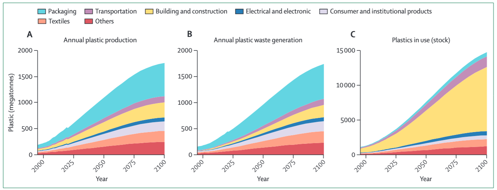
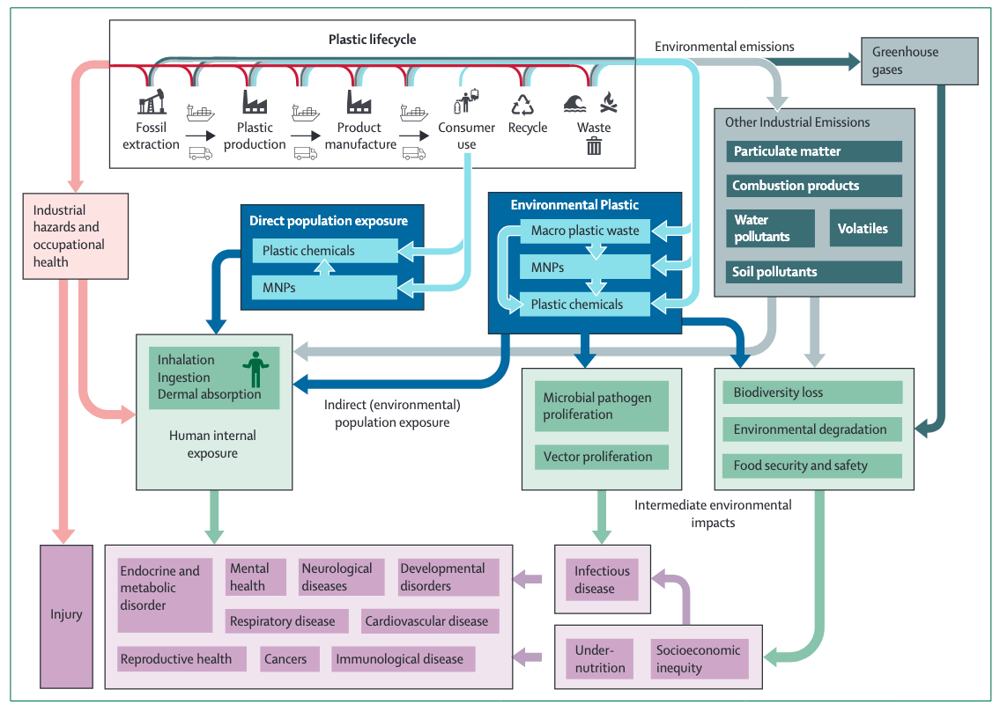

\thispagestyle{fancy}

<!-- Plastics -->
Human society arrived to the plastic age [@Thompson2009a].
Although plastic materials have contributed substantially to societal development, they have increasingly become a paradox for human progress.
Humans have benefited from the use of polymers since approximately 1600 BC, when the ancient Mesoamericans first processed natural rubber into balls, figurines and bands. 
Nevertheless, it was not until the $19^{th}$ that the development of modern synthetic thermoplastics began. 
In 1839, Goodyear developed vulcanized rubber, and Eduard Simon, a German apothecary, discovered polystyrene (PS).
The *Bakelite* was the first truly synthetic polymer developed by Belgian chemist Leo Baekeland in 1907. 
Since then, experimental work have continued on natural/synthetic polymers giving main inventions between the two World Wars: cellophane in 1913, then polyvinyl chloride (PVC) 
in 1927, nylon in 1938, and polyethylene in 1942 [@Andrady2009;@chalmin2019].
The development of synthetic polymers are typically prepared by polymerization of monomers derived from oil or gas. 
These synthetic polymers include several chemical additives to help in  color, processability, and thermal/mechanical properties.
It was not until the 1940s and 1950s, that mass production of everyday plastic items really started to take place [@Thompson2009a] and many other plastics were subsequently developed over the next few decades.

{#fig-1 width=90%}

However, plastics production and consumption is cause growing — and in some ways existential — risks for people and ecosystems.
Currently, 413 Mt in 2023 is produced worldwide as illustrated by @fig-1, and about half of all plastics produced have been made in the last 15 years. 
By 2050, the annual production is projected to increase by 2–3 times arriving to a global plastic production between 902 Mt to 1124 Mt.
It is proved that less than 10% of this production actually have been recycled since 1950 [@Geyer2017].
The compounding effect of plastic waste accumulation in the different ecosystems is an imminent risk for all biotic ecosystems.
Currently, 79% of this widely anthropogenic chemical subtance is accumulated in the environment, having a ubiquitous presence and polluting almost all compartiments of the ecosystem [@bundela2022;@hassan2024].
@landrigan2025 developed a diagram summarising plastics’ impacts on health as presented in @fig-2. 
Most of these established harms are mediated by exposure to plastic chemicals while others might be due to micro/nano plastic (MNP) particles.
Indeed, accumulation stock of MNP in the environment is starting to be used as stratigraphic markers in field archaeological practice as indicators of modern or recently disturbed deposits [@zalasiewicz2016]. 
This proves that it is a wicked problem, and one of the main markers of human presence on Earth.

{#fig-2 width=80%}

The major contradiction of plastic materials is that, while the first steps related to the production, usage and short-term post-usage (incineration, recycling) are relatively well known, the long-term that occurs after discarding (after reuse and recycling) remain largely unclear in its life cycle.
After discarding, conventional petrochemical plastics have been discovered behaving differently relative to traditional materials (i.e. metal, wood, glass). 
Plastic wastes do not solubilize slowly like dense materials, such as glass or metals, to reintegrate into silica or iron cycles and mineralize soils and water. 
They are also not digested by the micro-organisms naturally present in soils like natural organic materials, such as paper, cotton and leather, to reintegrate in the natural carbon cycle. 
In other words, *they do not reintegrate into one of the relatively well-known biogeochemical cycles of the elements of our ecosystems* [@gontard2022].
Therefore, this chemical polution is included as one of the planetary boundaries[@oneill2018;@biermann2020], which affects humanity for reminding within the safe operating limits.

In 2022, United Nations Environment Assembly (UNEA) of the United Nations Environment Programme (UNEP) proposed a draft resolution in order to adopt an international legally binding instrument by the year 2024 [@bundela2022]. 
The draft resolution shed ligths on two overarching themes: 
1) responsible consumption and prodution (SDG-12), and 
2) circular economy principles.
UNEA's draft resolution was aimed "*To promote sustainable production and consumption of plastics through, among other things, product design and environmentally sound waste management, including through resource efficiency and circular economy approaches*" [@unep2022].
In principle, 175 member stated on the UN agreed to this proposition [@arora2024].
One of the major advances was to the recognition of the seriousness of micro/nano-plastics (in marine and soil compartiments, and in the human health), which is a transboundary environmental issue [@landrigan2025].
The draft resolution made possible the establishment of an Intergovernmental Negotiating Committee (INC) with an ambitious objective of concluding an international legally binding instrument by the end of 2024.
Five sessions were made since 2022[^3].  
@guo2025 summarised the key negotiation milestones and issues of the treaty from 2022 to 2025.
However, *after five sessions of the INC so far (last at Geneva in August 2025), an agreement that all parties can abide by has remained elusive*.
Two main harsh truths were exposed. 
First, even if no state formally objects this agreement, a consensus on the treaty text cannot be reached. 
And second, securing a high-ambition treaty may require launching a new process outside the United Nations (UN) framework.

Entering in a more deep analysis of this controversy, it is possible elucidate three main aspects: 
1) definition of the plastic problem, 
2) procedural deadlock and 
3) delays in the ambition of the scope of the treaty.

<!-- Definitions -->
Concerning the definition issues, some countries have proposed narrow definition of '*plastic pollution*', limiting the definition to plastic products that have been mismanaged at the of life [@march2025]. 
Indeed, for certain nations, it was about improving waste management, recycling systems and circular economies. 
While for others, it meant curbing the manufacture of primary polymers.
Discrepancies also appeared in importance of the plastic value chain [@ivanova2025].
Plastic industry implies economic and political stability for some nations. 
Whereas for small island states and vulnerable coastal areas, plastic pollution threatens human survival.
The negotiations contrasted the economic realities of some countries with the ecological urgencies that imply plastic status-quo in some nations.
This diversity of perspectives in defining the nature of the problem leads to an ambiguity that is part of a geopolitical division.
Likewise, the definition of the 'full extent of the lifecycle of plastics' was a controversy. 
Some nations argued a position that lifecycle begins only after a plastic product has been manufactured. While for other nations, lifecycle begins from the extraction stage.  
Fortunaletly, a systemic definition of the *lifecycle of plastic* was adopted as: 
*"all the activities and outcomes associated with the production and consumption of plastic materials, products and services — from raw material extraction and processing (refining, cracking, polymerization) to design, manufacturing, packaging, distribution, use (and reuse), maintenance and end-of-life management, including segregation, collection, sorting, recycling and disposal"*.
The implication was that, without an appropriated definition of the full lifecycle, the treaty risk to becoming a *waste-management* agreement rather than a systemic answer of the plastic pollution [@simon2021]

<!-- 2) procedural deadlock -->
The second element of controversy to consider relies on the lack of a clear desicion-making process, either through voting or consensus.
A single dissenting country is at present empowered to veto important decisions.
Consequently, this allows a small number of countries to block progress, leading for example, to the blocking of any intersessional work after INC-3 (Nairobi, 2023) and to a substantial reduction in the mandate of the intersessional work agreed at INC-4 (Ottawa, 2024).
When a process works on consensus and you have a few countries refusing to move on certain things, it becomes very difficult to make progress.
Indeed, a number of countries — and UNEP itself — are strongly opposed to the introduction of voting, so that would be challenging to implement.

Finally, the ambition scope remains is major element of controverse. 
According to @ivanova2025, the negotiations have stalled partly because a false morality of *ambition* versus *obstruction* that took hold.
This kind of narrative between 'heroes versus villains' has obscured the complex realities at stake.
From one hand, there is the *High Ambition Coalition* of countries[^1] that have supported a treaty with global targets for reducing the production of primary plastic polymers to sustainable levels, elimination of single-use plastics, bans on hazardous additives, and regulate the entire life cycle of plastic.
On the other hand, a smaller group, the so-called Like-Minded Group [^2], that aims for a voluntary Global Plastics Treaty, opposing upstream measures and  prioritising only waste management.
Nonetheles to say that recent research suggests that capping primary plastic production at 2020 levels could significantly curb plastic pollution [@pottinger2024].
Addressing upstream plastic production is essential to ending plastic pollution
[@spring2025].
There is a third group of countries whose position has been more difficult to understand, including Brazil and China.

While plastics treaty ended without an official agreement, it did not collapse.
A third part of the Fifth Session (INC-5.3) will take place on 7 February 2026, Geneva, Switzerland.
I consider that despite the divergents perspectives, there are elements that all parties converge around, namely: leviers of *sustainable product design, resource efficiency, waste management and circular economy principles* [@ivanova2025].
Identifying areas of convergence and of contention is key. 
Indeed, @guo2025 pointed out that an effective treaty on plastics pollution control requires major players such as China, India and the United States to be a part of. 
Moreover, one structural element to hightlight is that there is no *formal system for sharing reliable scientific information on plastics within the negotiations*. 
Scientists can attend the talks, either as observers or as part of official delegations, but their research does not directly feed into the documents guiding the discussions. 
Recently , the establishment of the [Intergovernmental Science-Policy Panel on Chemicals, Waste and Pollution](https://www.unep.org/isp-cwp) seeks to narrow the gap.
One of the panel’s first tasks should be to bring clarity to the debate by building a shared understanding of the evidence on the issues at stake.
The first meeting will be in Geneva next February. 
This is a controverse that will continue its journey in the following years to come.

\newpage

# References {.unnumbered}

[^1]: 85 countries led by Rwanda and Norway, and including several states from Africa and EU. [See more details here: https://hactoendplasticpollution.org/](https://hactoendplasticpollution.org/)
[^2]: Petrochemical countries led by Saudi Arabia, including Iran, Iraq, India, Malaysia, Russia, Morocco, Uganda, Cuba, and Kazakhstan.
[^3]: INC-1 in Punta del Este, Uruguay (November–December 2022); INC-2 in Paris, France (May–June 2023); INC-3 in Nairobi, Kenya (November 2023); INC-4 in Ottawa, Canada (April 2024). The fifth session has been held in parts: Busan, Republic of Korea (INC-5.1, November–December 2024) and Geneva, Switzerland (INC-5.2, August 2025). The third part (INC-5.3) is scheduled for 7 February 2026 at the Geneva International Conference Centre (CICG). 