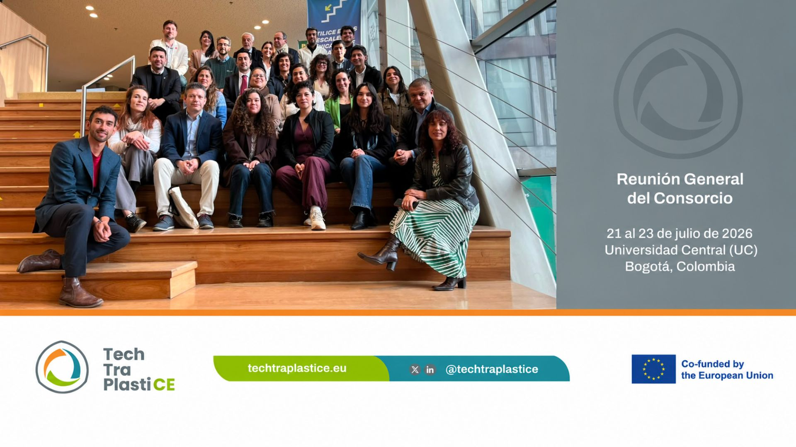
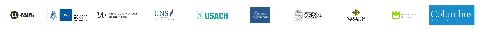

# Context

## Plastic waste as a societal issue

Plastic materials have enhanced the current living standards of society, bringing a plethora of products at a cost and functional effectiveness level. However, under linear and “business-as-usual” thinking, the plastic waste is creating a worldwide societal issue leading to crossing the planetary boundaries of chemical pollution in our natural ecosystems given the longevity and the unknown long impacts [@villarrubia-gomez2024].

In the past few decades, there has been a substantial increase in the yearly global plastic production, with it doubling between 2000 and 2019 to reach 460 million tones (Mt). 
The plastic market reached a value of 535 billion euros, and it also has an expected growth rate of 3.2%. Furthermore, it is expected to triple by 2060 according to the Organisation for Economic Co-operation and Development (OECD) in its rapport of  2022. 
Of the nearly 10,000 million metric tons of virgin plastic material produced from 1950 to 2019, approximately 7,500 million metric tons have been converted into plastic waste. From 156 Mt in 2000 to 353 Mt in 2019, with nearly two-thirds originating from applications with lifespans of fewer than five years: packaging (40%), consumer products (12%), and textiles (11%) according to the European association Plastic Europe in their document of 2019. 
Out of this waste, only 55 Mt were collected for recycling, while 22 Mt became recycling residues requiring final disposal. In the end, 9% of the world's plastic waste was recycled, 19% was incinerated, and almost 50% was deposited in sanitary landfills. The remaining 22% was either disposed of in uncontrolled dumpsites, burned in open pits, or leaked into the environment.   

## HEI as hubs for the systemic transition towards a just and safe circular economy.

Today, a systemic transition towards a just and safe circular economy needs to be made in the plastic value chain, understanding the technical, organizational, social, and legislative leverage points. Then, alternatives to mitigate the environmental impact need to be co-created in a trans-disciplinary approach in the global south as in the European countries. 

Therefore, the Higher Educational Institutions (HEI) have a major role to play in this worldwide societal issue. In the context of the green transition, universities have much to offer in joint green innovation projects with business, government and citizens. As hubs of diverse expertise, universities are uniquely placed to build interdisciplinary teams and bridge gaps between society and industry. Their regional ties also enable them to engage with the local ecosystem. Certainly, this is enframed as the HEI’s third mission to play a major role in the exchange of knowledge, know-how and technology among socio-economical stakeholders with the purpose to stimulate a transition including the whole stakeholders in the plastic value chain from pick-up waste collectors, consumers and industry ecosystems.  As there is no unique model to deal with plastic waste, proposed solutions should take into account the local ecosystem of stakeholders and be co-created in each country.

# Main Goal

This project aims to reinforce the applied research and innovation capacities of the universities to be a major actor in the circular economy transition for the plastic sector. 
**The main goal is to reinforce universities’ capacities through co-creating training, applied research and services portfolios to strengthen the plastic industry's contribution to the green transition and circular economy**. 

Considering that plastic waste is a wicked problem, the ambition is to foster the collaboration and partnerships of the University with socio-economic stakeholders for the incubation, development and establishment of circular initiatives.
The project will follow a progressive technology transfer approach to enable University-Industry Collaborations on joint recycling initiatives, integrating actors in the plastics value chain in Colombian, Argentinian, and Chilean contexts. 

These experiences seek to build interdisciplinary and multi-stakeholder approaches to advance shared research, innovation and educational/training capacities for plastic waste in the territories the partners are involved. The documentation of these collective experiences represents essential knowledge that provides insights for institutional recommendations for both the Global South and the European Union.

:::column-screen-inset
{#fig-id fig-alt="alt"}

{#fig-partners fig-alt="Partner logos of techtraplastice project"}
:::

