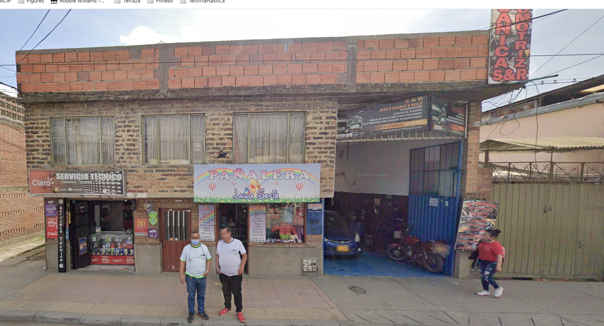
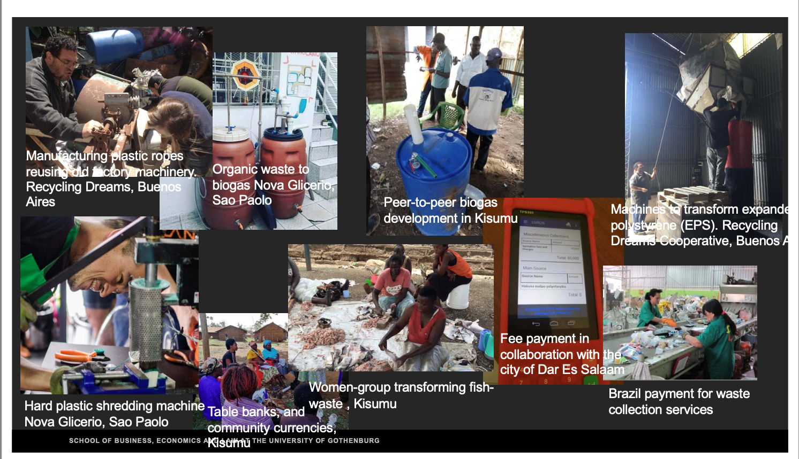

# What is '*Right to repair*' from Engineering perspective?

## Repair → European Commission 'New  Circular Economy' action plan

::: {layout="[48,-3, 50]"}

:::{}
**CE from EU view:** \newline

> "\small The circular economy is a model of production and consumption, which involves sharing, leasing, reusing, repairing, refurbishing and recycling existing materials and products as long as possible. In this way, the life cycle of products is extended." (European Parliament, 2023).
:::

![Repair as CE strategies. \newline Source: [@morseletto2020]](figures/Morseletto2020.png){fig-align="center" width="100%"}

:::

## Repair practice as a complex system

::: {layout="[50,50]"}

![Repair practice is part of a larger production and consumption system. Source: [@parajuly2023]](figures/parajuly2023.png){fig-align="center" width="100%"}

:::{}

**Techno--Economic**

- **Product design** → Influence on the reparability.
- **Business models**: Ownership,  and service models (ie. SAV )
- **Infrastructure:** Physical infrastructure (ie: tiers lieux?)

:::

:::

## From “right to repair” to “willingness to repair” 

::: {layout="[50,50]"}

![Consumer Barriers to Repair. Source: [@roskladka2023]](figures/roskladka2023-00.png){fig-align="center" width="50%"}

:::{}

**Barriers to repair practice:**

- **Technical**  Inappropriate product architecture → Obsolescence" 

- **Convenience**: 
   - Affordable infrastructure
   - Intangible costs (i.e cost of 'searching', 'waiting', 'frustation')

- **Willingness:** 

   - Repair culture built on  consumers’ trust.
   - Emotional attachement
   - Beliefs on 'repairability'

:::
:::

## From “right to repair” to “willingness to repair” 

::: {layout="[50,50]"}

![Consumer Barriers to Repair. Source: [@roskladka2023]](figures/roskladka2023-01.png){fig-align="center" width="50%"}

:::{}

![Case study (Italy): Washing machine: [@roskladka2023]](figures/roskladka2023-02.png){fig-align="center" width="70%"}

:::

:::

# Repair and the '*Tiers-lieux* et *Espace du faire*'?

::: {layout="[50,50]"}

:::{}
Perspective of:

- Grassroot Innovations [@enarsson2024] 
- Urban commons [@zapatacampos2020]

**Communities of Practice that *reinvent*, *appropriate*, and *foster* urban sustainability transitions.**
:::

:::{}

](figures/RFFF-carte.png){fig-align="center" width="70%"}

{fig-align="center" width="70%"}

:::
:::

## Repair and the '*Tiers-lieux* et *Espace du faire*'?

**Communities of Practice that *reinvent*, *appropriate*, and *foster* urban sustainability transitions.**

::: {layout="[50,50]" layout-valign="top"}
:::{}

\begin{enumerate}[\faCheck]
 \item Engaging people sustainable consumption 
 \item Foster ‘culture of repair’ (Creative and improvisation)
 \item Re-acquire use and repair skills (open the black box)
\end{enumerate}
:::

:::{}

\begin{enumerate}[\faTimesCircle]
 \item (Re)production of gender roles that are socially understood as traditional ?

\end{enumerate}

:::
:::

\vfill

Using citizen science research and Philosophy of Care, [@meissner2021a][^1] to study of collaborative repair practices among the participants in repair cafes.

[^1]: \tiny  Meissner, M., 2021. Repair is care? - Dimensions of care within collaborative practices in repair cafes. Journal of Cleaner Production 299, 126913. https://doi.org/10.1016/j.jclepro.2021.126913

# Repair and the Global South?

{fig-align="center" width="80%"}

## Repair and the Global South?

{fig-align="center" width="70%"}

Source. Maria José Zapata. 

## Open Questions

- Repair from *grassroot* to *mainstream*?
- Design for R-Framework? → skills and competences
- Appropriate certification and auditing of repair services ?
- Repair as care for *Object, each other, Community, environment*?

\vfill
\hfill
**Merci beaucoup !**

## References

\tiny

::: {#refs}
:::

