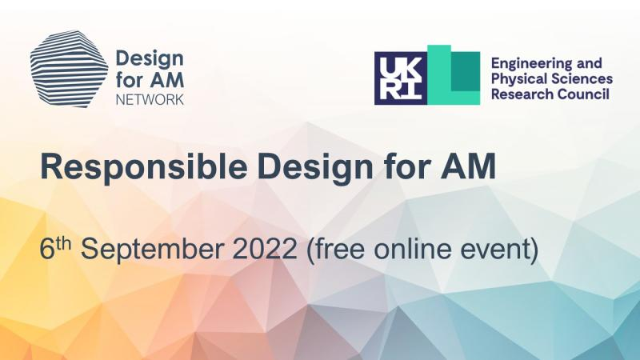

```{r setup, include=FALSE}
# Load packages -----
library(tidyverse)
library(xaringanExtra)
library(xaringanthemer)
library(fontawesome)
library(here)
#library(vembedr)
#library(xaringanBuilder)

source(here("static/talks/2022-09-UK","xaringan-themer.R"))

options(htmltools.dir.version = FALSE)
knitr::opts_chunk$set(
  fig.width=9, fig.height=3.5, fig.retina=3,
  out.width = "100%",
  cache = TRUE,
  echo = FALSE,
  message = FALSE, 
  warning = FALSE,
  hiline = TRUE,
  fig.align='center'
)


# Link for the Figures
URL = c('https://raw.githubusercontent.com/fabbiocrux/Figures/main/')

```


class: title-slide, center, bottom

#  `r rmarkdown::metadata$title`

** Workshop: Responsible Design for AM**
<br>

.pull-left[

```{r, out.width = '80%', fig.align='center'}


```
]

.pull-right[
### `r fa("comment", fill = "steelblue")` `r rmarkdown::metadata$author`
`r rmarkdown::metadata$subtitle` |  `r paste0("Nancy ",  format(Sys.time(), '%d %B, %Y'))`


```{r, echo=FALSE,out.width="49%", out.height="10%",fig.show='hold',fig.align='center'}
knitr::include_graphics(c(paste0(URL, 'Logos/ENSGSI/2022-ENSGSI.jpeg'), paste0(URL, 'Logos/ERPI/ERPI.svg')))

``` 

]

---
class: middle

# Outline 

1. .large.bg-yellow[**Who am I?**]
1. **Societal challengues for sustainable manufacturing **
1. Approach of Distribed Recycling via Additive Manufacturing
1. Put in reality


---

# Who am I?
.pull-left-1[
```{r, out.width = '60%', fig.align='center', out.extra='class="rounded"'}
knitr::include_graphics(paste0(URL, 'Fabio/Fabio.png'))
```

]

.pull-right-2[
```{r, out.width = '100%', fig.align='center'}
knitr::include_graphics(paste0(URL, 'LF2L/Concept/Concept-00.png'))
```

**Innovation**: 

- As a product.
- as a process.
- As a complex system.
- As territorial asset.
]

---


 .pull-left-2[
###  How I started in the 3D Printing world.?

```{r, echo=FALSE, out.width = '80%', fig.align='center'}
knitr::include_graphics(paste0(URL, 'LF2L/Fablab/Fablab-01.png'))
```
]
.pull-right-1[
```{r,  out.width = '90%', fig.align='center'}
knitr::include_graphics(paste0(URL, 'Foldarap/Emmanuel-00.jpeg'))
```

```{r,  out.width = '90%', fig.align='center'}
knitr::include_graphics(paste0(URL, 'Foldarap/Wiki.png'))
```

]

---
class: bottom, left
background-image: url(`r paste0(URL, 'Metodologies/Master-recherche/Master-00.png')`)
background-position: 50% 10%
background-size: 85%

Cruz Sanchez, F. A., Boudaoud, H., Muller, L. & Camargo, M. <br> Towards a standard experimental protocol for open source additive manufacturing. Virtual and Physical Prototyping 9, 151–167 (2014).

---

```{r, fig.cap=" ", out.width = '80%', fig.align='center'}
knitr::include_graphics(paste0(URL, 'AM/OS/Reprap-01.png'))
```

self-replicating manufacturing machine --> .bg-yellow[ ]?


Paradox of Jevons

---
exclude: true
class: middle

# Outline

1. Who am I?
1. .large.bg-yellow[**Societal challengues for sustainable manufacturing **]
1. Approach of Distribed Recycling via Additive Manufacturing
1. Put in reality

### .center[How .red[<ins>Additive manufacturing</ins>] impact the future....]

---

# Future of Additive Manufacturing

```{r}
knitr::include_graphics(paste0(URL, 'AM/Future/Future-01.png'))
```


---

class: inverse middle

# What are the real challengues for a sustainable manufacturing ?

---

class: top, left

## Anthropocène: <br>  Humans as a geological force ...

---

class: top, left
background-image: url(`r paste0(URL, 'Our-world-data/Emissions-by-sector.png')`)
background-position: right
background-size: contain


## Anthropocène: <br> Humans as a geological force ... <br>

<br> 
- .bg-red.white.large[[in CO2] ]. 

.pull-left[
- Climate neautrality & decarbonization
- Improvements in sector sector counts
]

---

class: top, left
background-image: url(`r paste0(URL, 'Anthropocene/de-la-torre2021.png')`)
background-position: 100% 70%
background-size: 60%


## Anthropocène: <br> Humans as a geological force ... <br> 
<br> 
- .bg-red.white.large[[in CO2]]
- .bg-red.white.large[[in Pollution]]. <br> 
.


.pull-left-1[
De-la-Torre, G. E., Dioses-Salinas, D. C., Pizarro-Ortega, C. I. & Santillán, L. New plastic formations in the Anthropocene. Science of The Total Environment 754, 142216 (2021).
]


---

class: middle, left
background-image: url(`r paste0(URL, 'CE/CalistoFriant2020.jpg')`)
background-position: right
background-size: contain

## What could be an <br> alternative model...

.pull-left-1.tiny[
Calisto Friant, M., Vermeulen, W.J.V., <br> Salomone, R., 2020. A typology of circular economy discourses: <br> Navigating the diverse visions of a contested paradigm.<br> Resour. Conserv. Recycl. 161, 104917. https://doi.org/10.1016/j.resconrec.2020.104917
]


---
class: middle, left
background-image: url(`r paste0(URL, 'Doughnut/Doughnut-00.png')`)
background-position: right
background-size: contain


## Doughnut Economics

- Holistic view other than GDP growth
- 'Sweet spot' between <br> minimal social requirements **AND** <br> Biophysical earth's boundaries.

.footnote[Raworth, K. A Safe and Just Space for Humanity: Can We Live within the Doughnut? Oxfam: Oxford, UK, 2012.
]

---
class: middle, left
background-image: url(`r paste0(URL, 'Doughnut/Doughnut-02.png')`)
background-position: right
background-size: contain


## Doughnut Economics

- Holistic view other than GDP growth
- 'Sweet spot' between <br> minimal social requirements **AND** <br> Biophysical earth's boundaries.

.footnote[Raworth, K. A Safe and Just Space for Humanity: Can We Live within the Doughnut? Oxfam: Oxford, UK, 2012.
]


???

- This approach is called Doughnut Economics proposed by the researcher Kate Raworth from Oxford and Cambrigde

---
# Doughnut Economics: .blue[Chile vs France]

.center[]

.footnote[O’Neill, D. W., Fanning, A. L., Lamb, W. F., & Steinberger, J. K. (2018). A good life for all within planetary boundaries. Nature sustainability, 1(2), 88-95. More details: https://goodlife.leeds.ac.uk .
]

---
class: middle, left
background-image: url(Figures/Planetary-boundaries-1.jpg)
background-position: right
background-size: contain

# Doughnut Economics: <br> .blue[World]

.pull-left[

- Imagine a country that satisfy the basic needs:  a long, healthy, happy life.

- Now, imagine this same country can do this without while use natural ressources in a sustainable way

- What about if all countries would do the same

]

.footnote[O’Neill, D. W., Fanning, A. L., Lamb, W. F., & Steinberger, J. K. (2018). <br/>A good life for all within planetary boundaries. Nature sustainability, 1(2), 88-95.  <br>   https://goodlife.leeds.ac.uk
]


---

---

class: middle

# Today, we need to include circularity in a micro/meso/macro level !!


---
class: top, left
background-image: url(`r paste0(URL, 'Green-Fablab/Green-fablab-2.jpg')`)
background-position: 50% 90%
background-size: 70%

# Distributed recycling via additive manufacturing

- Local closed-loop ➡️ Virgin materials ➡️ landfilling  

---

class: top, left
background-image: url(`r paste0(URL, 'Thesis/Recycling-00.jpg')`)
background-position: 50% 100%
background-size: 86%

## Technical validation of DRAM
---

class: top, left
background-image: url(`r paste0(URL, 'Pavlo/Pavlo-00.jpg')`)
background-position: 50% 50%
background-size: 95%


## Logistical validation of DRAM

---
class: top, left
background-image: url(`r paste0(URL, 'DRAM/SDRAM-01.jpg')`)
background-position: 50% 55%
background-size: 90%

## Global system

.pull-down.small[Cruz Sanchez, et al. Plastic recycling in additive manufacturing: A systematic literature review and opportunities for the circular economy. Journal of Cleaner Production (2020).]


---

class: top, left
background-image: url(`r paste0(URL, 'DRAM/SDRAM-02.jpg')`)
background-position: 50% 55%
background-size: 90%

## Global system

.pull-down.small[Cruz Sanchez, et al. Plastic recycling in additive manufacturing: A systematic literature review and opportunities for the circular economy. Journal of Cleaner Production (2020).]


---

class: top, left
background-image: url(`r paste0(URL, 'DRAM/SDRAM-03.jpg')`)
background-position: 50% 55%
background-size: 90%

## Global system

.pull-down.small[Cruz Sanchez, et al. Plastic recycling in additive manufacturing: A systematic literature review and opportunities for the circular economy. Journal of Cleaner Production (2020).]

---

class: top, left
background-image: url(`r paste0(URL, 'DRAM/SDRAM-04.jpg')`)
background-position: 50% 55%
background-size: 90%

## Global system

.pull-down.small[Cruz Sanchez, et al. Plastic recycling in additive manufacturing: A systematic literature review and opportunities for the circular economy. Journal of Cleaner Production (2020).]

---

class: top, left
background-image: url(`r paste0(URL, 'DRAM/SDRAM-05.jpg')`)
background-position: 50% 55%
background-size: 90%

## Global system

.pull-down.small[Cruz Sanchez, et al. Plastic recycling in additive manufacturing: A systematic literature review and opportunities for the circular economy. Journal of Cleaner Production (2020).]

---

class: top, left
background-image: url(`r paste0(URL, 'DRAM/SDRAM-06.jpg')`)
background-position: 50% 55%
background-size: 90%

## Global system

.pull-down.small[Cruz Sanchez, et al. Plastic recycling in additive manufacturing: A systematic literature review and opportunities for the circular economy. Journal of Cleaner Production (2020).]

---

class: top, left
background-image: url(`r paste0(URL, 'DRAM/SDRAM-07.jpg')`)
background-position: 50% 55%
background-size: 90%

## Global system

.pull-down.small[Cruz Sanchez, et al. Plastic recycling in additive manufacturing: A systematic literature review and opportunities for the circular economy. Journal of Cleaner Production (2020).]


---

class: bottom, left
background-image: url(`r paste0(URL, 'DRAM/SDRAM-00.svg')`)
background-position: 50% 5%
background-size: 80%

## Global system

.small[Cruz Sanchez, et al. Plastic recycling in additive manufacturing: A systematic literature review and opportunities for the circular economy. Journal of Cleaner Production (2020).]

---

class: middle 

# Putting things in **Do-It-Together**


---

## Projet EU H2020 INEDIT


.pull-left-1[
```{r, out.width = '80%'}
knitr::include_graphics(paste0(URL, 'Inedit/Inedit-01.svg'))
```

Open **IN**novation **E**cosystem for **D**o-**I**t-**T**ogether process

]

.pull-right-2[
```{r, out.width = '100%'}
knitr::include_graphics(paste0(URL, 'Inedit/WP2/DIT-model-00.png'))
```
]

---

## Demonstrateur Green Fablab

.pull-left[
```{r, out.width = '100%'}
knitr::include_graphics(paste0(URL, 'Inedit/WP7/INEDIT_Brochure-01.jpg'))
```
]

.pull-right[

- From DYI to the definition DIT `r fa("check", fill = "steelblue")`
- Formalisation DIT `r fa("check", fill = "steelblue")`
- Open Manufacturing Demostrator (OMDF) `r fa("spinner", fill = "steelblue")`
- .bg-green[**Demostrator (UL)**] `r fa("spinner", fill = "steelblue")`

```{r, out.width = '80%'}
knitr::include_graphics(paste0(URL, 'Green-Fablab/Logo-GF.png'))
```

]

---

class: bottom, left
background-image: url(`r paste0(URL, 'Octroi/Octroi-00.png')`)
background-position: 50% 50%
background-size: 90%

---
class: middle

.center[

```{r}
embed_youtube(
  "tQgD4KITCVE",
  width = 1200,
  height = 600,
  ratio = "4by3",
  frameborder = 0,
  allowfullscreen = TRUE,
)
```

]

---

class: top, left
background-image: url(`r paste0(URL, 'DRAM/DRAM-05.jpeg')`)
background-position: 50% 50%
background-size: 90%

## Future


---

background-image: url(`r paste0(URL, 'Ecoservices/Eco-Services-00.jpg')`)
background-position: 100% 80%
background-size: 50%

## Future

.bg-green[**Micro-industrial urban factories**] in the Antropocene:

.pull-left[
- Only **.red[tech-economic criteria]**  not enough for .orange[informed decision making]. 

- Need to assess value chains to include **all impacts on ecosystems**

- Bottom-up integration of **territorial and industrial systems** at levels:

  - Material 
  - Process 
  - Systems
  - Planetary
]

---

background-image: url(`r paste0(URL, 'Recycling/Enzymatic/Joshua2022.png')`)
background-position: 100% 55%
background-size: 50%

## Future

Micro-industrial urban factories in the Antropocene:

.pull-left[
- Only tech-economic criteria  not enough for informed decision making. 
- Need to assess value chains to include all impacts on ecosystems

- Bottom-up integration of territorial and industrial systems at levels:

  - .bg-yellow[**Material**] 💡
  - .bg-yellow[**Process**] 💡
  - Systems
  - Planetary
]


---

class: title-slide, center, bottom

#  `r rmarkdown::metadata$title`

** Workshop: Responsible Design for AM**
<br>

.pull-left[

```{r, out.width = '80%', fig.align='center'}


```
]

.pull-right[
### `r fa("comment", fill = "steelblue")` `r rmarkdown::metadata$author`
|  `r paste0("Nancy ",  format(Sys.time(), '%d %B, %Y'))`

### `r rmarkdown::metadata$email`

```{r, echo=FALSE,out.width="49%", out.height="10%",fig.show='hold',fig.align='center'}
knitr::include_graphics(c(paste0(URL, 'Logos/ENSGSI/2022-ENSGSI.jpeg'), paste0(URL, 'Logos/ERPI/ERPI.svg')))

``` 

]